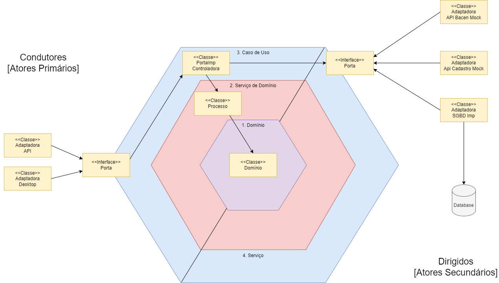
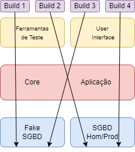

# API de Transferência


## Descrição

API de consulta e transferência entre contas com os seguintes requisitos:

1. Buscar o nome do Cliente na API de Cadastro (Mock)
2. Validar se a conta está ativa;
3. Validar se o Cliente tem o limite disponível na conta corrente;
4. Validar se a transferência está excedendo o limite diário de 1.000 reais;
5. Após a transferência é necessário informar o BACEN em uma API (Mock) que pode retornar 429 com seu controle de rate limit;
6. Impedir que falas momentâneas das dependências da aplicação impactem o cliente;
7.  Ser desenvolvida em Java/Spring Boot;
8. Apresentar testes unitários e automatizados.
9. Explorar Design patterns;
10. Implementar padrões de resiliência na aplicação.

---

## Pré Requisitos

- Ter a Openjdk ou JDK 17 devidamente configurada na máquina
- Ter o Gradle devidamente configurado na máquina
- Possuir o docker configurado

---


## Como foi construído?

Utilizando uma abordagem hexagonal representada pelas imagens a seguir:





---

## Como executar?

#### Preparando o ambiente

- Inicie seu docker:
```shell
"C:\PROGRA~1\Docker\Docker\Docker Desktop.exe"
``` 
- Execute o comando:
```shell
cd ./infra/docker-transfer/ && docker-compose up
``` 
- Se tudo ocorreu bem seu ambiente está configurado

#### Executando a aplicação API

- Vá para a pasta raiz do projeto
- Execute o comando: `gradle :initializers:api:run --args='--spring.profiles.active=hom'`
- !ATENÇÃO, não foram feitos testes no profile de prod, MAS O PROFILE DE HOMOLOGAÇÃO PREENCHERÁ OS DADOS NO BANCO DE DADOS QUE SUBIMOS NA INFRA COM O DOCKER!!!

---

## Como acessar e testar a aplicação?

#### Acessando a aplicação

- Abra seu navegador favorito
- Vá para o endereço: `http://localhost:8080/swagger-ui.html`
- Temos duas contas de Teste com ids:
    - 1
    - 2
    - 3

##### Testando recuperar conta com nome batendo na api de cadastro
- Acesse no swagger a área de Recuperar Contas
- Expanda o menu e clique em Try it out
- Digite o id com o npumero `1` mencionados acima
- Clique em `execute`
- Se você for no docker e recuperar os logs de cadastro verá que foi consultado:
    - `API MOCK para correntista encontrou o cliente de id: 1`
- Se você pesquisar novamente a API de Contas buscará o resultado no Redis
- Pesquise o outro id com o número `2`
- Agora podemos derrubar no docker o container de cadastro
- Ao pesquisar vemos que não tivemos erro ao recuperar o nome do cadastro
- POR FIM RODE NOVAMENTE NO DOCKER A API DE CADASTRO
- Se recuperarmos a conta 3 veremos que ela está inativa

##### Realizando uma transferência

Acesse no swagger a área de Realizar Transferencias
- Expanda o menu e clique em Try it out
- Utilize o id `2` para conta de débito e o id `1` para conta de crédito
- Troque o valor da transferência por 300:
```json
{
	"valorTransferencia": 300
}
```
- Clique em `execute`
- Você receberá o retorno:
```json
{
  "timestamp": "2024-01-xxT22:46:59.374Z",
  "exception": "NegocioException",
  "messages": [
    "Saldo insuficiente."
  ],
  "path": "/transferencias/2/contas/1"
}

```
- Altere os ids e transfira os 300, você receberá a seguinte mensagem:
  `Transferencia realizada com sucesso`
- Se você transferir mais 701 receberá a seguinte mensagem:
```json
{
  "timestamp": "2024-01-12T22:50:33.385Z",
  "exception": "NegocioException",
  "messages": [
    "Transacao acima do limite diario restante: R$700.00 ."
  ],
  "path": "/transferencias/1/contas/2"
}
```

#### Validando a fila do RabbitMQ

- Abra uma nova aba no seu navegador e acesse: `http://localhost:15672/`
- Utilize o usuário e senha padrão com o valor `guest` para ambos os campos
- Acesse o site e vá na aba `Queues and Streams`
- Derrube a api do bacen no docker.
- Faça uma nova transferência válida como mostrado no passo a passo anterior
- Você verá no swagger a mensagem de sucesso e na fila verá que teve um aumento de mensagens armazenadas.
- Clique em `bacen-queue` na tabela e recupere uma mensagem em `Get messages`, você verá:
```text
The server reported 0 messages remaining.

Exchange	(AMQP default)
Routing Key	bacen-queue
Redelivered	○
Properties	
priority:	0
delivery_mode:	2
headers:	
content_encoding:	UTF-8
content_type:	text/plain
Payload
39 bytes
Encoding: string
{"idDebito":1,"idCredito":2,"valor":70}
```

---


1. [x] Buscar o nome do Cliente na API de Cadastro (Mock)
2. [x] Validar se a conta está ativa;
3. [x] Validar se o Cliente tem o limite disponível na conta corrente;
4. [x] Validar se a transferência está excedendo o limite diário de 1.000 reais;
5. [x] Após a transferência é necessário informar o BACEN em uma API (Mock) que pode retornar 429 com seu controle de rate limit;
6. [x] Impedir que falas momentâneas das dependências da aplicação impactem o cliente;
7. [x]  Ser desenvolvida em Java/Spring Boot;
8. [x] Apresentar testes unitários e automatizados.
    - Testes unitários na camada de sistema, serviços e adaptadores
    - Alguns testes automatizados na camada desktop
9. [x] Explorar Design patterns;
    - Hexagonal e MVC
10. [x] Implementar padrões de resiliência na aplicação.
    - Cache-Aside: manter os dados em cache para reduzir o número de chamadas a api e melhorar o desempenho.
    - Fallback: fornecer uma resposta alternativa ou um comportamento padrão quando uma operação falha, para minimizar o impacto no usuário final.
    - Queue: enfileirar as requisições que não podem ser processadas imediatamente, para evitar perda de dados e permitir o processamento posterior.